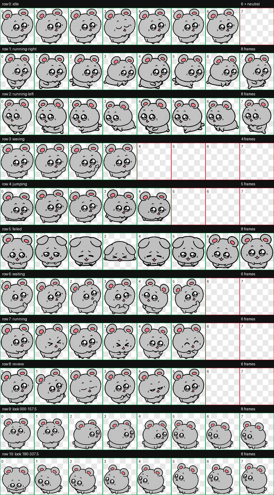
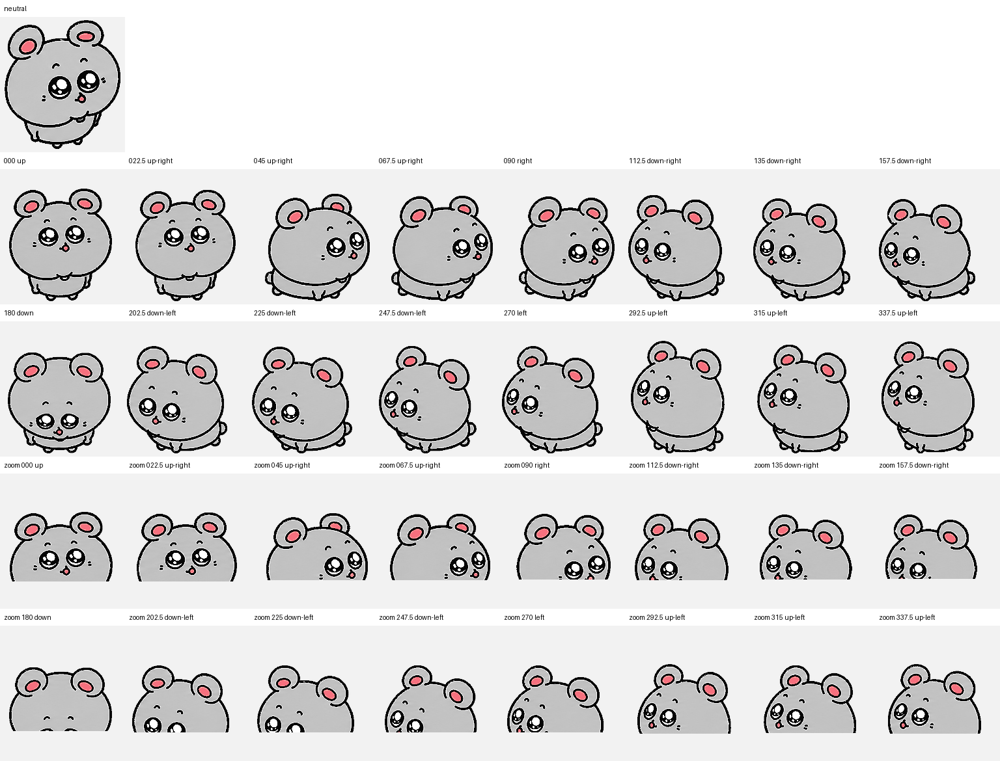

# Dashu Codex Pet / 大鼠 Codex 宠物

## English

Dashu is a Codex-compatible animated pet based on a cute chibi gray rat (`大鼠`): round ears, pink inner ears, glossy eyes, tiny paws, and a small pink mouth.

This repository contains the final boundary-clean v2 pet package. The animation and look directions are preserved, while the sprite colors have been cleaned so black outlines, gray body, pink ears/mouth, and white eye highlights stay in their own color regions.

### Preview





### Files

- `pet/pet.json` - Codex pet metadata.
- `pet/spritesheet.webp` - Final v2 8x11 spritesheet.
- `assets/contact-sheet.png` - Full animation preview sheet.
- `assets/look-directions.png` - Focused look-direction QA sheet.
- `qa/validation.json` - Validation result for the boundary-clean atlas.
- `qa/run-summary.json` - Build and QA summary.
- `scripts/install.sh` - Local install helper.

### Install

From the repository root:

```bash
./scripts/install.sh
```

This copies the pet into:

```text
~/.codex/pets/dashu
```

### Pet Contract

- `spriteVersionNumber`: `2`
- Atlas size: `1536x2288`
- Cell size: `192x208`
- Layout: 8 columns x 11 rows
- Format: WebP RGBA
- Validation: passed with no errors or warnings

### For Users

To download and install this pet from a Git repository:

```bash
git clone <repo-url>
cd dashu-codex-pet
./scripts/install.sh
```

Useful commands:

```bash
git status
git pull
git log --oneline
```

### Notes

Dashu uses subtle, face-led look directions to keep the original sticker-like expression. Intermediate diagonal gaze cues are intentionally gentle; the cardinal directions pass QA.

---

## 中文

Dashu 是一个兼容 Codex 的动态宠物，原型是一只可爱的 Q 版灰色大鼠：圆耳朵、粉色内耳、亮晶晶的大眼睛、小爪子，以及一个很小的粉色嘴巴。

这个仓库包含最终的 boundary-clean v2 宠物包。动作和视线方向都保留了，同时对精灵图颜色做了边界清理，让黑色描边、灰色身体、粉色耳朵/嘴巴、白色眼睛高光都尽量守在自己的颜色区域里，不互相晕染。

### 预览


### 文件说明

- `pet/pet.json` - Codex 宠物元数据。
- `pet/spritesheet.webp` - 最终 v2 8x11 精灵图。
- `assets/contact-sheet.png` - 全部动画动作预览。
- `assets/look-directions.png` - 视线方向 QA 预览。
- `qa/validation.json` - boundary-clean 图集的校验结果。
- `qa/run-summary.json` - 生成和 QA 汇总。
- `scripts/install.sh` - 本地安装脚本。

### 安装

在仓库根目录运行：

```bash
./scripts/install.sh
```

脚本会把宠物复制到：

```text
~/.codex/pets/dashu
```

### 宠物规格

- `spriteVersionNumber`: `2`
- 图集尺寸：`1536x2288`
- 单格尺寸：`192x208`
- 布局：8 列 x 11 行
- 格式：WebP RGBA
- 校验结果：通过，无错误、无警告

### 给使用者

如果别人想从 Git 仓库下载并安装这个宠物，可以运行：

```bash
git clone <repo-url>
cd dashu-codex-pet
./scripts/install.sh
```

常用命令：

```bash
git status
git pull
git log --oneline
```

### 说明

Dashu 的视线方向比较克制，主要通过脸和眼睛表达，这样可以保留原始贴纸风格的可爱表情。中间斜向视线会比较柔和，但四个主方向已经通过 QA。
